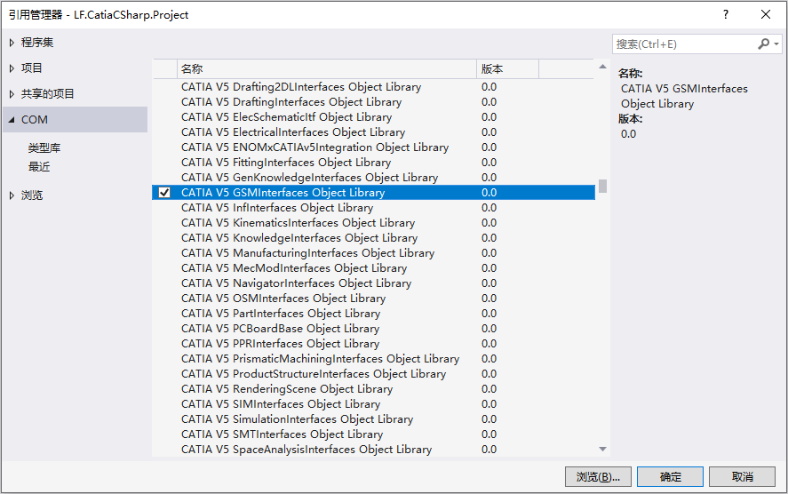
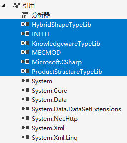

# 基于CSharp的Catia二次开发库

## 一、基本信息

- **库名称**：`LF.CatiaCSharp`
- **版　本**：V1.0
- **时　间**：2021年6月10日

##　二、启动Catia

### 2.1. 命名空间

#### 2.1.1 添加引用

添加引用`CATIA V5 GSMInterfaces Object Library`，只需添加这一个，其余需要的引用会自动添加。



添加引用之后，引用列表里面就会多出这几个库。 



#### 2.1.2 导入命名空间

```c
using INFITF;
using MECMOD;
using HybridShapeTypeLib;
```

### 2.2 启动Catia

#### 2.2.1 定义变量

```c#
public Application CatiaApp;            // Catia应用程序
public PartDocument Doc;                // 零件文件
public Part Part;                       // 零件
public HybridBodies Bodies;             // 混合体集合
public HybridBody Body;                 // 混合体
public HybridShapeFactory Shapes;       // 混合形状
```

#### 2.2.2  Catia启动函数

```c#
/// <summary>
/// 启动CATIA
/// </summary>
public void Startup()
{
    try
    {
        CatiaApp = (INFITF.Application)Marshal.GetActiveObject("CATIA.Application");
    }
    catch
    {
        Type oType = System.Type.GetTypeFromProgID("CATIA.Application");
        CatiaApp = (INFITF.Application)Activator.CreateInstance(oType);
        CatiaApp.Visible = true;
    }

    try
    {
        Doc = (PartDocument)CatiaApp.ActiveDocument;
    }
    catch { }

    if (Doc == null)
    {
        Doc = (PartDocument)CatiaApp.Documents.Add("Part");
    }
    // 初始化
    Part = Doc.Part;
    Bodies = Part.HybridBodies;
    Body = Bodies.Add();
    Shapes = (HybridShapeFactory)Part.HybridShapeFactory;
}
```

## 三、基本绘图

### 3.1 基本图形绘制

#### 3.1.1 绘制点

-   根据点的绝对坐标绘制点 `public Reference DrawPoint(double x, double y, double z)`
-   根据参考点的相对坐标绘制点 `public Reference DrawPoint(Reference p, double x, double y, double z)`
-   绘制两点的中点 `public Reference DrawCenterPoint(Reference p1, Reference p2)`
