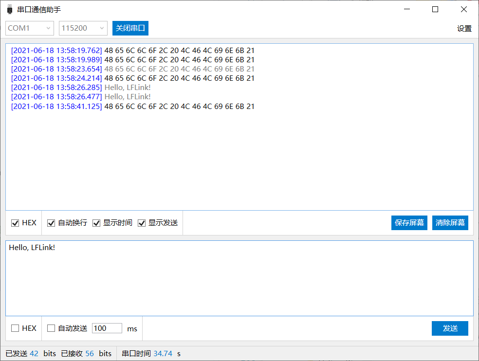

# 串口通信助手

## 一、基本信息

- 项目名称：`LF.SerialCommunication.Project`
- 创建日期：2021-06-11
- 版　　本：V1.0

## 二、基本功能

### 2.1 配置串口参数

### 2.2 打开和关闭串口

### 2.3 显示收发量

### 2.4 保存接收数据

## 三、接收和发送

### 3.1 接收数据

#### （1）普通接收

#### （2）按协议接收

### 3.2 发送数据

#### （1）普通发送
#### （2）定时发送
#### （3）多条发送
#### （4）按协议发送

## 四、软件界面

