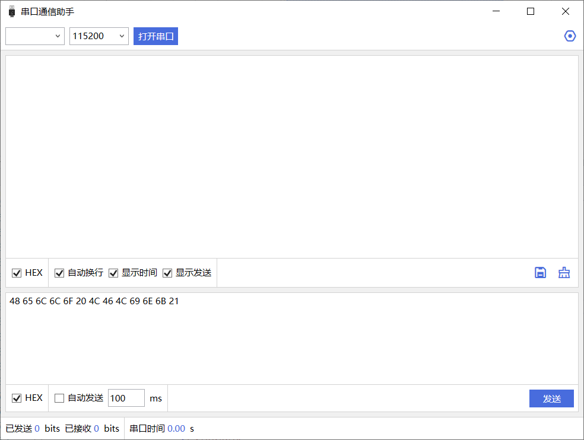
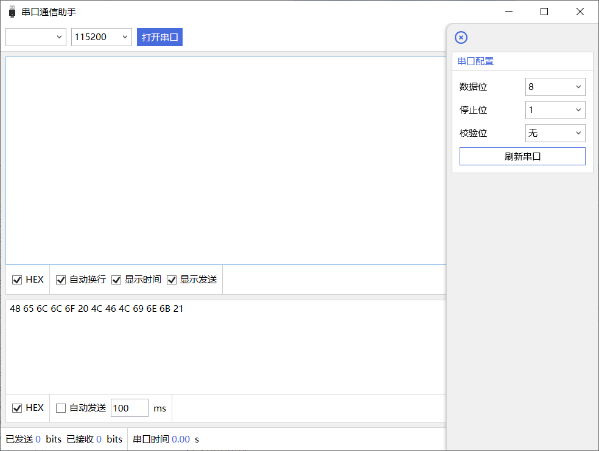

# 串口通信助手

## 一、基本信息

-   项目名称：串口通信助手 `LF.SerialCommunication.Project`
-   创建时间：
-   核心库：[通信库](../../../Libraries/Common/LF.Communication)  `LF.Communication`

## 二、软件功能

1.  完成搜索串口、配置串口、打开串口、关闭串口等串口的基础操作；
2.  实时显示串口收发信息，包括收发内容、收发量等，以及串口运行时间；
3.  自定义接收与显示格式，选择文本格式和16进制格式。

## 三、软件界面

